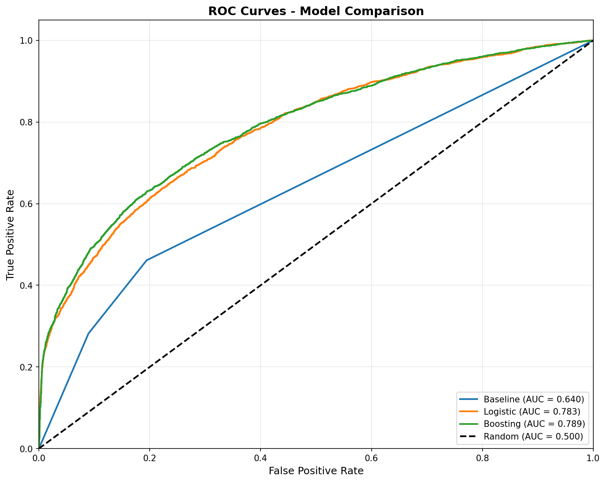
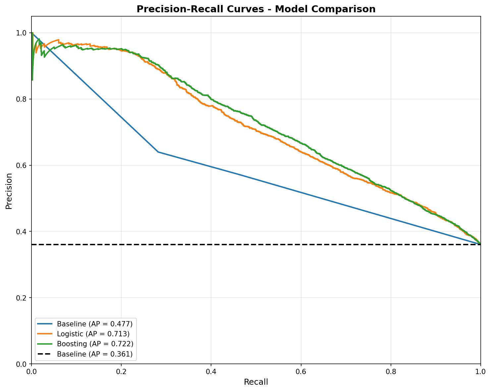
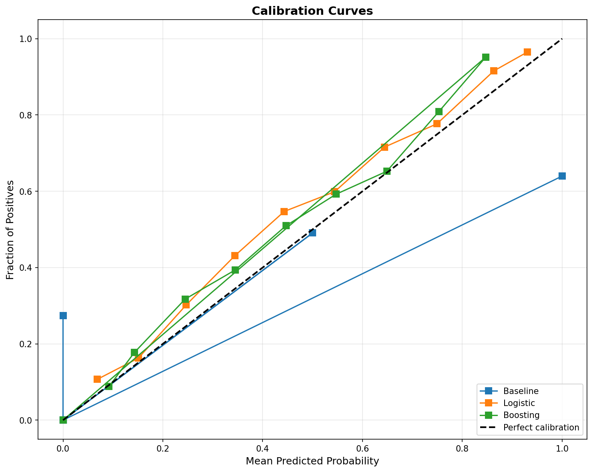
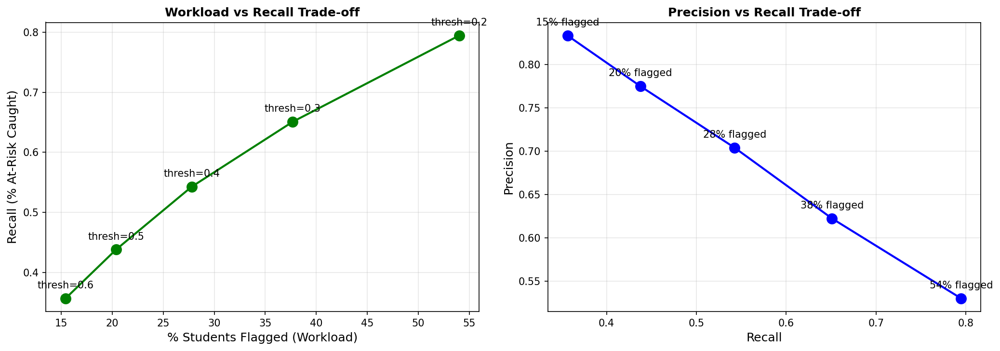

# 🎓 OULAD Early Warning System

[](https://www.python.org/downloads/)
[](https://opensource.org/licenses/MIT)
[](https://github.com/psf/black)

> **Interpretable Decision Support System for Early Student Risk Detection**  
> *Research project on the effectiveness of digital technologies for improving pedagogical practice*

---


### Overview

An interpretable machine learning system that helps instructors identify at-risk students within the first two weeks of a course. Built on the Open University Learning Analytics Dataset (OULAD), this Decision Support System (DSS) balances prediction accuracy with instructor workload.

**Key Features:**
- ⚡ **Early Detection**: Uses only first 14 days of activity data
- 📊 **High Performance**: AUC=0.789, Average Precision=0.722
- 🎯 **Workload-Aware**: Flags only 15% of students (84% precision, 35% recall)
- 🔍 **Interpretable**: Provides clear explanations for each alert
- 📧 **Actionable**: Generates personalized email templates

### 🎯 Research Context

**Topic**: Investigating the effectiveness of digital technologies for improving professional teaching practice

**Focus**: Model for studying the impact of digital technologies on pedagogical practice, used as a decision support tool

**Dataset**: Open University Learning Analytics Dataset (OULAD)
- 22,437 students
- 7 courses
- Multiple presentations (semesters)

### 📊 Results Preview

| Model | AUC | Average Precision | Brier Score |
|-------|-----|-------------------|-------------|
| Baseline | 0.640 | 0.477 | 0.284 |
| Logistic Regression | 0.783 | 0.713 | 0.175 |
| **LightGBM** | **0.789** | **0.722** | **0.172** |

**At 15% flagging rate (recommended threshold=0.607):**
- Precision: 84.1% (8 out of 10 flags are true positives)
- Recall: 35.0% (catches 1 in 3 at-risk students)
- True Positives: 1,076
- False Positives: 203

### 🖼️ Visualizations

<details>
<summary>Click to expand</summary>

**ROC Curves**


**Precision-Recall Curves**


**Calibration Analysis**


**Workload Trade-offs**


</details>

### 🚀 Quick Start

#### Prerequisites

```bash
Python 3.8+
64GB RAM recommended for processing large VLE dataset
```

#### Installation

```bash
# Clone repository
git clone https://github.com/YOUR_USERNAME/oulad-early-warning.git
cd oulad-early-warning

# Create virtual environment
python -m venv env
source env/bin/activate  # On Windows: env\Scripts\activate

# Install dependencies
pip install -r requirements.txt
```

#### Download OULAD Dataset

1. Download from [Analyse dataset](https://analyse.kmi.open.ac.uk/open_dataset)
2. Extract CSV files to `data/raw/`

#### Run Pipeline

```bash
# 1. Process data and create features
python test_pipeline.py

# 2. Train models
python scripts/03_train_models.py

# 3. Evaluate models
python scripts/04_evaluate_models.py

# 4. Generate DSS output
python scripts/05_generate_dss_output.py
```

### 📁 Project Structure

```
oulad_early_warning/
│
├── data/
│   ├── raw/                    # Original OULAD CSV files
│   └── processed/              # Processed datasets
│
├── src/
│   ├── data/                   # Data loading and processing
│   │   ├── loader.py
│   │   ├── cleaner.py
│   │   └── merger.py
│   ├── features/               # Feature engineering
│   │   ├── activity.py
│   │   ├── assessment.py
│   │   └── demographic.py
│   ├── models/                 # ML models
│   │   ├── baseline.py
│   │   ├── logistic.py
│   │   └── boosting.py
│   └── dss/                    # Decision Support System
│       ├── alerter.py
│       ├── explainer.py
│       └── reporter.py
│
├── notebooks/                  # Jupyter notebooks for EDA
│   └── 01_data_exploration.ipynb
│
├── scripts/                    # Executable scripts
│   ├── 03_train_models.py
│   ├── 04_evaluate_models.py
│   └── 05_generate_dss_output.py
│
├── results/
│   ├── figures/               # Plots for paper
│   ├── models/                # Saved models
│   └── dss_output/           # Alert lists and templates
│
├── requirements.txt
├── README.md
└── LICENSE
```

### 🔬 Methodology

#### Feature Engineering

**Activity Features** (first 14 days):
- `total_clicks`: Total LMS interactions
- `active_days_ratio`: Proportion of days with activity
- `days_since_last_activity`: Recency of engagement

**Assessment Features**:
- `completed_first_assessment`: Binary indicator
- `first_assessment_score`: Performance (0-100)
- `first_assessment_on_time`: Submission timeliness

**Demographic Features**:
- `education_level`: Prior education (encoded 0-4)
- `age_group`: Age band (0-2)
- `num_of_prev_attempts`: Repeat student indicator

#### Models

1. **Baseline**: Simple threshold rules
2. **Logistic Regression**: Interpretable with odds ratios
3. **LightGBM**: Best performance with calibration

#### Evaluation Metrics

- **AUC-ROC**: Overall discrimination ability
- **Average Precision**: Precision-Recall summary
- **Brier Score**: Calibration quality
- **Workload Analysis**: Precision-Recall at different flagging rates

### 📧 DSS Output Example

The system generates:

1. **Instructor Alert List** (CSV):
   - Student ID
   - Risk level (Low/Medium/High/Critical)
   - Risk probability
   - Specific alert reasons
   - Activity metrics

2. **Summary Statistics** (TXT):
   - Total and flagged student counts
   - Risk level distribution
   - Average metrics

3. **Email Templates** (TXT):
   - Personalized outreach messages
   - Action steps for students
   - Support resources

### 🔑 Key Findings

**Top Risk Factors** (from Logistic Regression odds ratios):
1. `first_assessment_score_norm` (OR=0.48) - Strong protective factor
2. `total_clicks` (OR=0.78) - Low activity increases risk
3. `education_level` (OR=0.76) - Higher education protective

**Feature Importance** (from LightGBM):
1. `avg_clicks_per_day` (415.2)
2. `total_clicks` (383.2)
3. `first_assessment_score_norm` (366.0)

### 📚 Citation

If you use this work in your research, please cite:

```bibtex
@software{oulad_early_warning_2025,
  author = {Oleksandr Kuznetsov},
  title = {OULAD Early Warning System: Interpretable Student Risk Detection},
  year = {2025},
  url = {https://github.com/KuznetsovKarazin/oulad-early-warning}
}
```

### 🤝 Contributing

Contributions are welcome! Please feel free to submit a Pull Request.

### 📄 License

This project is licensed under the MIT License - see the [LICENSE](LICENSE) file for details.

### 🙏 Acknowledgments

- Open University for providing the OULAD dataset
- Research community working on Learning Analytics
- All contributors and users of this system

### 📧 Contact

For questions or collaboration opportunities:
- **Email**: oleksandr.o.kuznetsov@gmail.com

---

